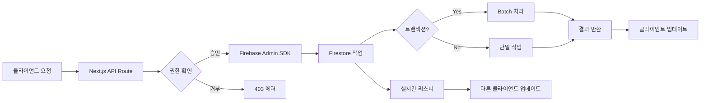

# 🔄 KGF Nexus 시스템 플로우 분석

> 시스템의 전체 데이터 흐름과 상호작용을 분석한 문서

## 📊 시스템 플로우 다이어그램

### 1. 사용자 인증 플로우
```mermaid
graph TD
    A[사용자 접속] --> B{로그인 상태?}
    B -->|No| C[로그인 페이지]
    B -->|Yes| D{역할 확인}
    
    C --> E[이메일/비밀번호 입력]
    E --> F[Firebase Auth 인증]
    F --> G{인증 성공?}
    G -->|No| C
    G -->|Yes| H[Firestore 프로필 조회]
    
    H --> I{승인 상태?}
    I -->|Pending| J[승인 대기 페이지]
    I -->|Active| D
    
    D -->|Super Admin| K[/super-admin]
    D -->|Federation Admin| L[/admin]
    D -->|Club Owner| M[/club-dashboard]
    D -->|Member| N[/my-profile]
```

### 2. 데이터 CRUD 플로우


---

## 🔍 핵심 데이터 플로우

### 1. 회원 등록 프로세스
```typescript
// 데이터 흐름 순서
1. 클럽 관리자가 회원 정보 입력
   ↓
2. 유효성 검증 (클라이언트)
   ↓
3. Firestore에 회원 문서 생성
   - members/{memberId}
   ↓
4. 연령 카테고리 자동 계산
   ↓
5. 클럽 통계 업데이트
   - clubs/{clubId}.memberCount++
   ↓
6. 감사 로그 생성
   - audit_logs/{logId}
   ↓
7. 실시간 업데이트 트리거
   - 다른 관리자 화면 자동 갱신
```

### 2. 회원권 구매 프로세스
```typescript
// 복합 트랜잭션 플로우
1. 회원이 회원권 템플릿 선택
   ↓
2. 결제 정보 입력
   ↓
3. Batch 트랜잭션 시작
   ├── member_passes 생성
   ├── payments 생성
   ├── members.hasActivePass = true
   └── clubs.revenue += amount
   ↓
4. 이메일 알림 발송
   ↓
5. 대시보드 통계 업데이트
```

### 3. 권한 변경 실시간 반영
```typescript
// 실시간 권한 업데이트 메커니즘
1. 관리자가 사용자 역할 변경
   ↓
2. Firestore users/{userId}.role 업데이트
   ↓
3. onSnapshot 리스너 감지
   ↓
4. 클라이언트 Context 업데이트
   ↓
5. useEffect 트리거
   ↓
6. 자동 리다이렉트 실행
   - 권한 없는 페이지 → 허용된 페이지
```

---

## 🏗️ 컴포넌트 상호작용 맵

### 1. 페이지 컴포넌트 계층
```
RootLayout
├── FirebaseProvider (Context)
│   ├── AuthProvider
│   └── UserProvider
├── ModernLayout
│   ├── Header
│   │   ├── GlobalSearch
│   │   └── UserMenu
│   ├── Sidebar
│   │   └── Navigation
│   └── MainContent
│       └── [PageComponent]
└── ErrorBoundary
```

### 2. 데이터 흐름 계층
```
PageComponent
├── useUser() Hook
│   └── Firebase Auth State
├── useCollection() Hook
│   └── Firestore Realtime
├── Local State
│   └── useState/useReducer
└── Actions
    ├── API Calls
    └── Direct Firestore
```

---

## 📈 상태 관리 전략

### 1. 전역 상태 (Context)
```typescript
// Firebase Context
{
  auth: Auth Instance,
  firestore: Firestore Instance,
  user: Current User Profile,
  loading: Boolean
}

// 사용처
- 모든 페이지 컴포넌트
- 인증이 필요한 API 호출
- 실시간 데이터 구독
```

### 2. 로컬 상태 (Component State)
```typescript
// 페이지별 상태
{
  data: [], // 페이지 특정 데이터
  loading: false, // 로딩 상태
  error: null, // 에러 상태
  filters: {}, // 필터/검색 조건
  pagination: {} // 페이지네이션
}

// 관리 방법
- useState: 단순 상태
- useReducer: 복잡한 상태
- Custom Hooks: 재사용 로직
```

### 3. 캐시 전략
```typescript
// 메모리 캐시 (5분)
const cache = new Map();
const CACHE_TTL = 5 * 60 * 1000;

// 사용 예시
if (cache.has(key) && !isExpired(cache.get(key))) {
  return cache.get(key).data;
}
const data = await fetchData();
cache.set(key, { data, timestamp: Date.now() });
```

---

## 🔐 보안 플로우

### 1. 인증 체크 플로우
```
요청 → 미들웨어 → 세션 확인 → 역할 확인 → 접근 허용/거부
         ↓                        ↓
    로그인 리다이렉트        403 페이지
```

### 2. 데이터 접근 제어
```typescript
// Firestore Rules 플로우
match /clubs/{clubId} {
  // 읽기: 소속 회원만
  allow read: if isAuthenticated() && 
    userBelongsToClub(clubId);
  
  // 쓰기: 클럽 관리자만
  allow write: if isAuthenticated() && 
    isClubManager(clubId);
}
```

---

## 🚀 성능 최적화 플로우

### 1. 데이터 로딩 최적화
```typescript
// 병렬 로딩 패턴
const loadDashboardData = async () => {
  const [members, classes, payments] = await Promise.all([
    fetchMembers(),
    fetchClasses(), 
    fetchPayments()
  ]);
  
  // 순차 로딩 대비 3x 빠름
};
```

### 2. 렌더링 최적화
```typescript
// 메모이제이션 패턴
const MemberList = memo(({ members }) => {
  // 불필요한 리렌더링 방지
});

const filteredMembers = useMemo(() => {
  // 계산 비용이 큰 필터링
  return members.filter(/* ... */);
}, [members, searchTerm]);
```

---

## 📱 반응형 디자인 플로우

### 브레이크포인트 전략
```css
/* Tailwind 브레이크포인트 */
sm: 640px   /* 모바일 */
md: 768px   /* 태블릿 */
lg: 1024px  /* 데스크톱 */
xl: 1280px  /* 대형 화면 */
```

### 레이아웃 변환
```
Desktop (lg+)
[Sidebar] [Content]

Tablet (md)
[Drawer] [Content]

Mobile (sm)
[Bottom Nav]
[Content]
```

---

## 🔄 배포 플로우

### 1. CI/CD 파이프라인
```
GitHub Push → GitHub Actions → Build → Test → Deploy
                                 ↓       ↓       ↓
                              실패시   실패시   Firebase
                              알림     롤백     App Hosting
```

### 2. 환경별 설정
```typescript
// 환경 변수 관리
Development: .env.local
Staging: .env.staging  
Production: Firebase Config
```

---

## 📊 모니터링 플로우

### 1. 에러 추적
```typescript
// 에러 캡처 플로우
에러 발생 → ErrorBoundary → 로깅 → 알림
            ↓               ↓       ↓
          폴백 UI      Firebase   Slack
                       Analytics
```

### 2. 성능 모니터링
```typescript
// Web Vitals 추적
FCP → LCP → TTI → CLS
 ↓     ↓     ↓     ↓
분석 → 최적화 → 재배포 → 검증
```

---

## 🎯 핵심 비즈니스 로직

### 1. 역할 계층 구조
```
Super Admin (13)
    ↓ 모든 권한
Federation Admin (12)
    ↓ 연맹 관리
Club Owner (7)
    ↓ 클럽 관리
Club Manager (6)
    ↓ 운영 지원
Member (2)
    ↓ 개인 정보
Parent (1)
    최소 권한
```

### 2. 데이터 소유권
```
연맹 → 여러 클럽
클럽 → 여러 회원
회원 → 여러 수업
보호자 → 여러 자녀
```

---

## 💡 개발 팁

### 1. 디버깅 플로우
```bash
# 1. 콘솔 로그 확인
console.log(데이터)

# 2. React DevTools
컴포넌트 상태 확인

# 3. Firebase Console
데이터베이스 직접 확인

# 4. Network Tab
API 요청/응답 확인
```

### 2. 일반적인 문제 해결
```
문제: 무한 루프
해결: useEffect 의존성 배열 확인

문제: 권한 오류
해결: Firebase Rules 확인

문제: 느린 로딩
해결: 병렬 쿼리 적용

문제: 실시간 업데이트 안됨
해결: onSnapshot 리스너 확인
```

---

*이 플로우 분석과 함께 제공된 문서들을 참고하면 시스템의 전체적인 동작을 완벽히 이해할 수 있습니다.*
