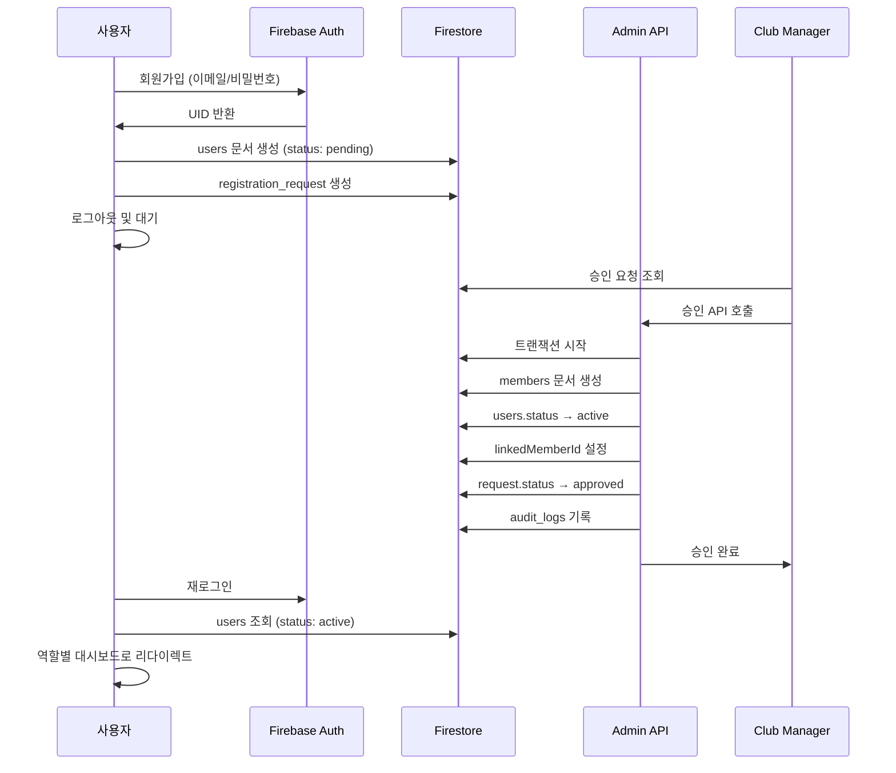
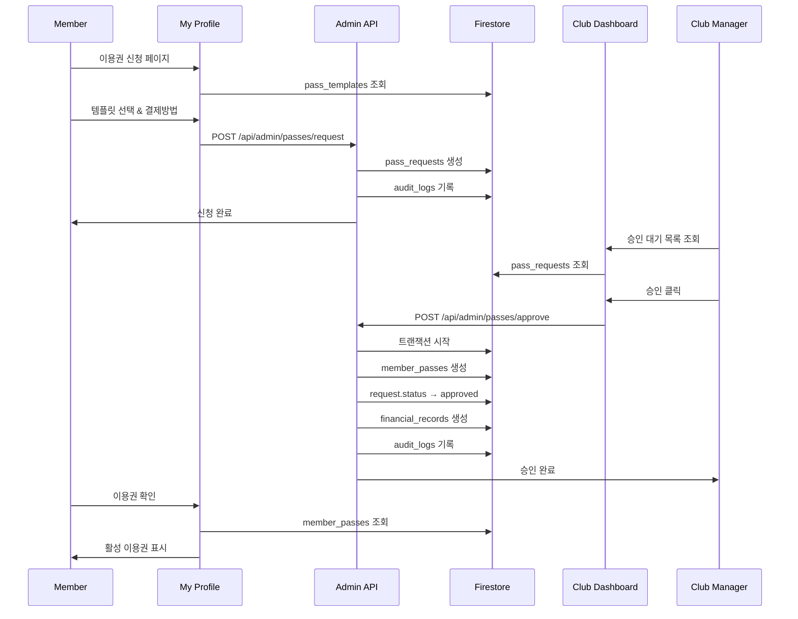

# 역할별 대시보드 구조 및 데이터 흐름 분석 보고서

## 📊 전체 시스템 구조도

```mermaid
graph TB
    subgraph "사용자 계층"
        SA[Super Admin]
        FA[Federation Admin]
        CO[Club Owner]
        CM[Club Manager]
        HC[Head Coach]
        AC[Assistant Coach]
        M[Member]
        P[Parent]
    end
    
    subgraph "대시보드 계층"
        SAD[/super-admin]
        FAD[/admin]
        CD[/club-dashboard]
        MP[/my-profile]
    end
    
    subgraph "데이터 계층"
        Users[users]
        Members[members]
        Clubs[clubs]
        Requests[registration_requests]
        Passes[member_passes]
        Classes[gym_classes]
        Finance[financial_records]
    end
    
    SA --> SAD
    FA --> FAD
    CO --> CD
    CM --> CD
    HC --> CD
    AC --> CD
    M --> MP
    P --> MP
    
    SAD --> Users
    FAD --> Clubs
    CD --> Members
    MP --> Passes
```

## 🎯 1. 역할별 접근 권한 매트릭스

| 역할 | 레벨 | 대시보드 | 권한 범위 | 데이터 접근 |
|------|------|----------|-----------|------------|
| **SUPER_ADMIN** | 100 | /super-admin | 전체 시스템 관리 | 모든 데이터 읽기/쓰기 |
| **FEDERATION_ADMIN** | 90 | /admin | 연맹 전체 관리 | 연맹 데이터 읽기/쓰기 |
| **FEDERATION_SECRETARIAT** | 80 | /admin | 연맹 운영 지원 | 연맹 데이터 읽기, 제한적 쓰기 |
| **COMMITTEE_CHAIR** | 70 | /committees | 위원회 관리 | 위원회 데이터 읽기/쓰기 |
| **COMMITTEE_MEMBER** | 60 | /committees | 위원회 참여 | 위원회 데이터 읽기 |
| **CLUB_OWNER** | 50 | /club-dashboard | 클럽 전체 관리 | 클럽 데이터 읽기/쓰기 |
| **CLUB_MANAGER** | 45 | /club-dashboard | 클럽 운영 | 클럽 데이터 읽기/쓰기 |
| **CLUB_STAFF** | 40 | /club-dashboard | 제한적 클럽 운영 | 수업/출석 데이터 |
| **HEAD_COACH** | 35 | /club-dashboard | 수업 관리 | 수업/회원 데이터 |
| **ASSISTANT_COACH** | 30 | /club-dashboard | 수업 보조 | 수업 데이터 읽기 |
| **MEDIA_MANAGER** | 40 | /club-dashboard/media | 미디어 관리 | 미디어/공지 데이터 |
| **MEMBER** | 20 | /my-profile | 개인 정보 | 본인 데이터만 |
| **PARENT** | 15 | /my-profile | 가족 정보 | 본인+자녀 데이터 |
| **VENDOR** | 10 | /my-profile | 제한적 접근 | 벤더 관련 데이터만 |

## 🏗️ 2. 대시보드별 구조 및 기능

### 2.1 Super Admin Dashboard (/super-admin)
```
📁 /super-admin
├── 📊 시스템 현황
│   ├── 전체 통계
│   ├── 시스템 모니터링
│   └── 감사 로그
├── 👥 사용자 관리
│   ├── 클럽 오너 승인
│   ├── 연맹 관리자 임명
│   └── 권한 관리
├── 🔧 시스템 관리
│   ├── 데이터베이스 리셋
│   ├── 캐시 관리
│   └── 설정 관리
└── 📈 분석
    ├── 성과 지표
    └── 시스템 사용 패턴
```

**주요 기능:**
- 클럽 오너 요청 승인/거부
- 연맹 관리자 임명
- 시스템 전체 리셋
- 캐시 및 모니터링 관리

### 2.2 Federation Admin Dashboard (/admin)
```
📁 /admin
├── 📊 연맹 현황
│   ├── 클럽 통계 (활성/비활성)
│   ├── 회원 통계
│   ├── 대회 현황
│   └── 위원회 현황
├── 🏢 클럽 관리 (/admin/clubs)
│   ├── 클럽 목록
│   ├── 클럽 등록
│   └── 클럽 상태 관리
├── 👥 회원 관리 (/admin/members)
│   ├── 전체 회원 조회
│   ├── 회원 검색
│   └── 회원 상태 관리
├── 🏆 대회 관리 (/admin/competitions)
│   ├── 대회 등록
│   ├── 대회 운영
│   └── 채점 관리
├── 🎖️ 심판 관리 (/admin/judges)
│   ├── 심판 등록
│   └── 심판 배정
├── 📋 위원회 관리 (/admin/committees)
│   ├── 위원회 생성
│   └── 위원 관리
└── ✅ 승인 관리 (/admin/approvals)
    ├── 코치 승인
    └── 기타 요청 승인
```

**주요 기능:**
- 연맹 전체 통계 대시보드
- 클럽 생성 및 관리
- 대회 운영
- 심판 및 위원회 관리

### 2.3 Club Dashboard (/club-dashboard)
```
📁 /club-dashboard
├── 📊 클럽 현황
│   ├── 회원 통계 (성인/아동)
│   ├── 수업 현황
│   └── 출석률
├── 👥 회원 관리
│   ├── 회원 승인 (/member-approvals)
│   │   ├── 성인 회원 승인
│   │   ├── 가족 회원 승인
│   │   └── 일반 회원 승인
│   ├── 회원 목록
│   └── 회원 검색
├── 🎓 수업 관리 (/classes)
│   ├── 수업 생성
│   ├── 수업 일정
│   ├── 출석 체크 (/attendance)
│   └── 수업 현황 (/class-status)
├── 🎫 이용권 관리 (/passes)
│   ├── 이용권 템플릿 (/pass-templates)
│   ├── 이용권 승인 (/approvals)
│   └── 이용권 현황
├── 💰 재무 관리 (/finance)
│   ├── 결제 관리 (/payments)
│   ├── 수입/지출
│   └── 재무 보고서
├── 🎯 레벨 테스트 (/level-tests)
│   ├── 테스트 생성
│   └── 평가 (/evaluate)
├── 🏅 이벤트 관리 (/events)
├── 📢 공지사항 (/announcements)
├── 💬 메시지 (/messages)
├── 📸 미디어 (/media)
├── 📈 분석 (/analytics)
├── 👨‍🏫 코치 관리 (/coaches)
└── ⚙️ 설정 (/settings)
```

**주요 기능:**
- 회원 승인 프로세스
- 수업 및 출석 관리
- 이용권 발급 및 관리
- 재무 관리
- 레벨 테스트 관리

### 2.4 My Profile (/my-profile)
```
📁 /my-profile
├── 👤 개인 정보
│   ├── 프로필 수정
│   └── 계정 설정
├── 👨‍👩‍👧‍👦 가족 관리 (/family)
│   ├── 가족 구성원 조회
│   └── 자녀 추가 (/add-child)
├── 🎫 이용권
│   ├── 현재 이용권
│   ├── 이용권 신청
│   └── 이용 내역
├── 📅 수업
│   ├── 수강 중인 수업
│   └── 출석 현황
├── 🏆 대회
│   ├── 참가 신청
│   └── 참가 이력
├── 📢 공지사항
└── 🎯 레벨 테스트
    ├── 테스트 신청
    └── 결과 조회
```

**주요 기능:**
- 개인/가족 정보 관리
- 이용권 신청
- 수업 및 출석 확인
- 대회 참가 신청

## 📊 3. 데이터 흐름 분석

### 3.1 회원가입 및 승인 플로우


### 3.2 이용권 신청 및 승인 플로우


### 3.3 데이터 접근 패턴

#### 읽기 작업 (Firestore 직접)
- 목록 조회
- 통계 데이터
- 실시간 업데이트 (리스너)

#### 쓰기 작업 (Admin API 경유)
- 회원 승인
- 상태 변경
- 이용권 발급
- 재무 기록

## 🔐 4. 보안 및 권한 체계

### 4.1 Firestore Rules 구조
```javascript
// users 컬렉션
- 읽기: 본인, 관리자, 클럽 스태프
- 수정: 
  - 본인: 비민감 필드만
  - API: 민감 필드 (status, role, clubId)

// members 컬렉션
- 읽기: 관리자, 클럽 스태프, 본인
- 생성/삭제: API 전용
- 수정: 
  - 클럽 스태프: 비민감 필드
  - API: 모든 필드

// 승인 요청 컬렉션
- 읽기: 관리자, 클럽 스태프, 본인
- 쓰기: API 전용
```

### 4.2 API 보안 계층
1. **인증 미들웨어**: Bearer 토큰 검증
2. **권한 검증**: 역할 기반 접근 제어
3. **레이트 리미팅**: 
   - 민감 작업: 5분당 10회
   - 일반 작업: 15분당 100회
   - 읽기: 15분당 500회
4. **감사 로깅**: 모든 변경사항 기록
5. **캐싱**: 
   - 사용자: 5분
   - 클럽: 30분
   - 회원: 10분

## 📈 5. 성능 최적화 전략

### 5.1 캐싱 전략
- **LRU 캐시**: 자주 접근하는 데이터
- **메모이제이션**: Firebase 쿼리
- **병렬 쿼리**: Promise.allSettled 활용

### 5.2 쿼리 최적화
- **인덱스 활용**: 복합 인덱스 설정
- **페이지네이션**: 대량 데이터 처리
- **선택적 필드**: 필요한 필드만 조회

### 5.3 UI/UX 최적화
- **스켈레톤 로딩**: 로딩 상태 표시
- **낙관적 업데이트**: 즉각적인 UI 반응
- **에러 바운더리**: 격리된 에러 처리

## 🎯 6. 주요 비즈니스 로직

### 6.1 회원 카테고리 시스템
- **성인 (18세 이상)**
- **청소년 (14-17세)**
- **아동 (13세 이하)**

### 6.2 이용권 시스템
- **템플릿 기반**: 표준화된 이용권
- **기간제**: 1개월, 3개월, 6개월, 1년
- **횟수제**: 10회, 20회, 30회
- **자동 만료**: 기간 경과 시

### 6.3 수업 및 출석 시스템
- **정규 수업**: 주간 반복
- **특별 수업**: 일회성
- **출석 체크**: QR코드 또는 수동
- **출석률 통계**: 자동 계산

## 📝 7. 개선 제안사항

1. **실시간 알림 시스템**
   - WebSocket 또는 SSE 도입
   - 푸시 알림 지원

2. **고급 분석 대시보드**
   - 데이터 시각화 강화
   - 예측 분석 기능

3. **모바일 앱**
   - React Native 기반
   - 오프라인 지원

4. **결제 시스템 통합**
   - PG사 연동
   - 자동 결제

5. **AI 기반 기능**
   - 자동 일정 최적화
   - 회원 이탈 예측
