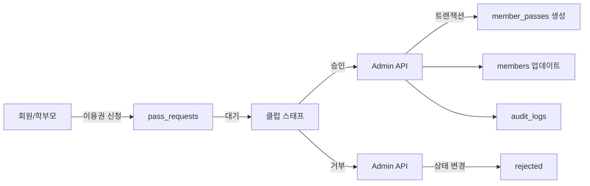

# 이용권 시스템 Admin SDK 전환 완료

## 📅 완료일: 2024-10-31

## 🎯 전환 배경
이용권(Pass) 시스템은 결제와 직결되는 민감한 기능으로, 무단 발급 및 데이터 조작 위험이 있었습니다.
기존에는 클럽 스태프가 Firestore에 직접 쓰기 권한을 가지고 있어 보안 취약점이 존재했습니다.

## ✅ 구현 완료 항목

### 1. **타입 정의 개선**
`/src/types/business.ts`
- `PassRequest` 타입 추가 (신규/갱신 통합)
- 기존 `PassRenewalRequest`는 레거시로 유지

### 2. **API 엔드포인트 구현**

#### 이용권 요청 생성
- **POST** `/api/admin/passes/request`
- 회원/학부모가 이용권 신청
- 중복 요청 방지 로직
- 요청자 권한 검증 (본인 또는 자녀만)

#### 이용권 승인
- **POST** `/api/admin/passes/approve`
- 클럽 스태프/관리자만 가능
- 트랜잭션으로 원자성 보장:
  - `member_passes` 생성
  - `members.activePassId` 업데이트
  - 갱신인 경우 기존 이용권 만료
  - 감사 로그 기록

#### 이용권 거부
- **POST** `/api/admin/passes/reject`
- 거부 사유 필수
- 요청 상태만 업데이트

#### 이용권 취소
- **POST** `/api/admin/passes/cancel`
- 활성 이용권 취소
- `members.activePassId` 초기화

### 3. **Firestore Rules 수정**
```javascript
// member_passes: API만 생성/수정/삭제
match /member_passes/{passId} {
  allow read: if ...; // 읽기는 유지
  allow create: if false;
  allow update: if false;
  allow delete: if false;
}

// pass_requests: 새로운 컬렉션
match /pass_requests/{requestId} {
  allow read: if isAdmin() || isClubStaff() || 
               (isAuthenticated() && resource.data.requestedBy == request.auth.uid);
  allow create: if isAuthenticated(); // 회원이 신청
  allow update: if false; // API만
  allow delete: if false; // API만
}
```

### 4. **클라이언트 코드 전환**

#### 이용권 요청 페이지
`/src/app/club-dashboard/passes/page.tsx`
- 직접 Firestore 쓰기 → API 호출로 전환
- 템플릿 선택, 결제 방법, 비고 입력 UI
- `adminAPI.passes.requestPass()` 사용

#### 승인 페이지
`/src/app/club-dashboard/approvals/page.tsx`
- `pass_requests` 컬렉션 조회
- 테이블 UI로 요청 목록 표시
- 승인/거부 API 호출
- 거부 시 사유 입력 다이얼로그

### 5. **API 클라이언트 업데이트**
`/src/utils/api-client.ts`
```typescript
adminAPI.passes = {
  requestPass: async (data) => {...},
  approve: async (requestId) => {...},
  reject: async (requestId, reason) => {...},
  cancel: async (passId, reason) => {...}
}
```

## 🔄 워크플로우



## 📊 보안 개선 효과

### Before
- 클럽 스태프가 무제한 이용권 발급 가능
- 트랜잭션 미사용으로 데이터 정합성 위험
- 감사 로그 없음
- 승인 프로세스 없음

### After
- **승인 프로세스**: 요청 → 승인 → 활성화
- **트랜잭션 보장**: 원자적 처리
- **감사 로깅**: 모든 작업 추적
- **권한 검증**: 본인/자녀만 신청 가능

## 🚀 성능 최적화
- 캐싱: 회원 정보 캐시 무효화
- 레이트 리미팅: 표준 제한 (100 req/15min)
- 에러 핸들링: ApiError 클래스 사용

## ⚠️ 주의사항

1. **마이그레이션**
   - 기존 `pass_renewal_requests` 데이터는 유지
   - 새로운 요청은 `pass_requests` 사용

2. **결제 연동**
   - 현재 `paymentStatus`는 'pending'으로 생성
   - 추후 결제 시스템 연동 필요

3. **템플릿 관리**
   - `pass_templates`는 여전히 클럽 스태프가 직접 관리
   - 템플릿은 덜 민감한 데이터로 판단

## 📝 테스트 시나리오

1. **이용권 요청**
   - 회원 로그인 → 이용권 요청 → 템플릿 선택 → 제출
   - `pass_requests`에 'pending' 상태로 생성 확인

2. **승인 프로세스**
   - 클럽 스태프 로그인 → 승인 페이지 → 요청 승인
   - `member_passes` 생성 및 `members.activePassId` 업데이트 확인

3. **거부 프로세스**
   - 거부 사유 입력 → 거부
   - `pass_requests.status` = 'rejected' 확인

4. **이용권 취소**
   - 활성 이용권 취소
   - `status` = 'cancelled' 및 `activePassId` = null 확인

## 🔜 향후 개선사항

1. **자동 만료 처리**
   - Cron job으로 만료된 이용권 자동 처리

2. **결제 시스템 통합**
   - PG사 연동으로 자동 결제 처리

3. **알림 시스템**
   - 승인/거부 시 회원에게 알림

4. **대시보드**
   - 이용권 통계 및 분석 화면

## 📌 결론
이용권 시스템의 Admin SDK 전환으로 **보안성**, **데이터 정합성**, **감사 가능성**이 크게 향상되었습니다.
특히 결제와 관련된 민감한 데이터를 안전하게 관리할 수 있게 되었습니다.
