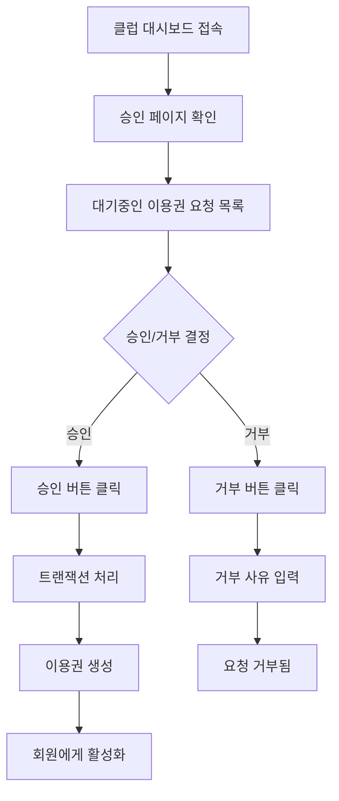
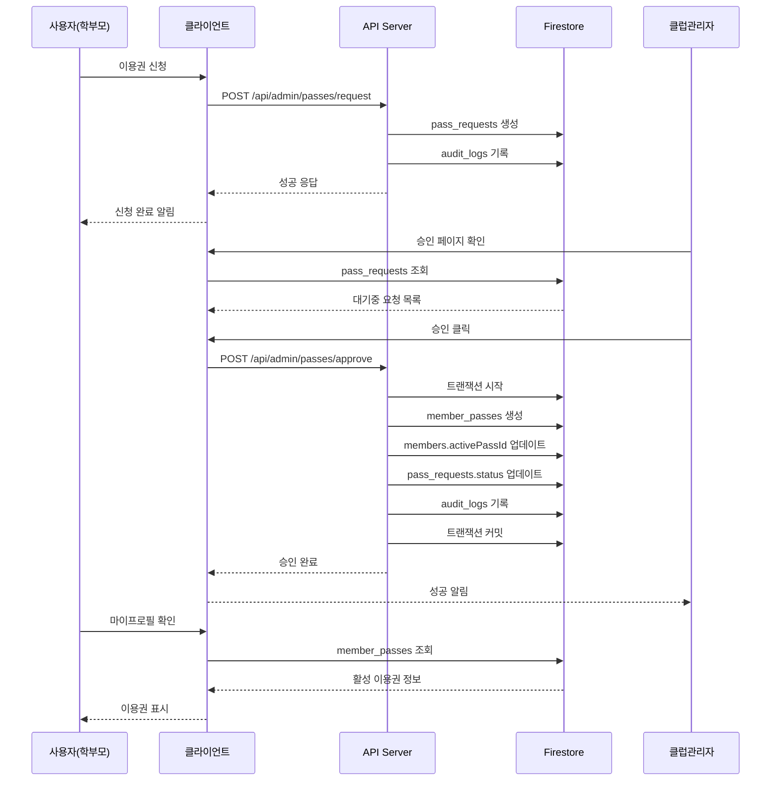

# 이용권 시스템 사용자 흐름 가이드

## 📋 개요
이 문서는 이용권(Pass) 시스템의 올바른 사용자 흐름을 정의합니다.
2024-10-31 업데이트 기준으로 API 기반 승인 시스템이 구현되었습니다.

## 👥 사용자 역할별 흐름

### 1. 학부모/회원 (이용권 신청자)

```mermaid
graph TD
    A[가입 시 자녀 정보 입력] --> B[클럽 관리자 승인 대기]
    B --> C[승인 완료]
    C --> D[마이프로필 접속]
    D --> E[자녀 목록 확인]
    E --> F[자녀별 이용권 신청 버튼 클릭]
    F --> G[템플릿 선택]
    G --> H[결제 방법 선택]
    H --> I[비고 입력(선택)]
    I --> J[신청 완료]
    J --> K[승인 대기 상태]
    K --> L[관리자 승인]
    L --> M[이용권 활성화]
    M --> N[마이프로필에서 이용권 정보 확인]
```

#### 상세 단계:

1. **회원가입 및 자녀 등록**
   - 경로: `/register/family`
   - 자녀 정보 입력 (이름, 생년월일 등)
   - 클럽 선택 후 가입 신청

2. **마이프로필 접속**
   - 경로: `/my-profile`
   - 승인된 후 자녀 목록 표시
   - 자녀별 이용권 상태 확인 가능

3. **이용권 신청**
   - 자녀 카드에서 "신규 이용권 신청" 버튼 클릭
   - 모달 창에서:
     - 이용권 템플릿 선택 (월간, 세션권 등)
     - 결제 방법 선택 (현금/카드/계좌이체)
     - 추가 메모 입력 (선택)
   - API 호출: `POST /api/admin/passes/request`

4. **이용권 확인**
   - 승인 대기: Badge로 상태 표시
   - 승인 완료: 활성 이용권 정보 표시
   - 이용권 내역 확인 가능

### 2. 클럽 관리자/스태프 (이용권 승인자)



#### 상세 단계:

1. **승인 대기 목록 확인**
   - 경로: `/club-dashboard/approvals`
   - 테이블 형식으로 요청 목록 표시
   - 정보: 회원명, 이용권 종류, 결제 방법, 신청일

2. **승인 처리**
   - 승인 버튼 클릭
   - API 호출: `POST /api/admin/passes/approve`
   - 트랜잭션으로 처리:
     - `member_passes` 문서 생성
     - `members.activePassId` 업데이트
     - 감사 로그 기록

3. **거부 처리**
   - 거부 버튼 클릭
   - 거부 사유 입력 다이얼로그
   - API 호출: `POST /api/admin/passes/reject`

4. **이용권 현황 관리**
   - 경로: `/club-dashboard/passes`
   - 전체 이용권 통계 확인
   - 회원별 이용권 상태 조회
   - 필터링: 성인/유소년

## 🔒 보안 및 권한

### API 기반 처리
모든 민감한 작업은 Admin SDK를 통해 처리됩니다:

| 작업 | 권한 | API 엔드포인트 |
|------|------|--------------|
| 이용권 신청 | 인증된 사용자 | `/api/admin/passes/request` |
| 이용권 승인 | 클럽 스태프/관리자 | `/api/admin/passes/approve` |
| 이용권 거부 | 클럽 스태프/관리자 | `/api/admin/passes/reject` |
| 이용권 취소 | 클럽 스태프/관리자 | `/api/admin/passes/cancel` |

### Firestore Rules
```javascript
// member_passes: API 전용
match /member_passes/{passId} {
  allow read: if ...; // 읽기는 허용
  allow create, update, delete: if false; // 쓰기는 API만
}

// pass_requests: 신청은 가능, 수정은 API만
match /pass_requests/{requestId} {
  allow create: if isAuthenticated();
  allow update, delete: if false;
}
```

## 📱 UI/UX 개선사항

### 1. 마이프로필 페이지 (`/my-profile`)
- ✅ 자녀별 카드 UI
- ✅ 이용권 상태 Badge 표시
- ✅ 이용권 신청 모달
- ✅ 결제 방법 선택 UI
- ✅ API 기반 신청 처리

### 2. 승인 페이지 (`/club-dashboard/approvals`)
- ✅ 테이블 형식 요청 목록
- ✅ 실시간 상태 업데이트
- ✅ 거부 사유 입력 다이얼로그
- ✅ 로딩 상태 표시

### 3. 이용권 현황 페이지 (`/club-dashboard/passes`)
- ✅ 통계 카드 (전체/활성/미보유/매출)
- ✅ 카테고리별 필터링 (성인/유소년)
- ✅ 읽기 전용 현황 표시
- ❌ 직접 발급 기능 제거

## 📊 데이터 흐름



## ⚠️ 주의사항

1. **클라이언트 직접 쓰기 금지**
   - `member_passes` 컬렉션에 직접 쓰기 불가
   - 모든 이용권 생성은 API를 통해서만 가능

2. **트랜잭션 보장**
   - 이용권 승인 시 여러 문서가 원자적으로 업데이트
   - 실패 시 전체 롤백

3. **감사 로깅**
   - 모든 이용권 관련 작업은 `audit_logs`에 기록
   - 추적 가능성 100% 보장

## 🔄 마이그레이션 체크리스트

- [x] API 엔드포인트 구현
- [x] 마이프로필 페이지 수정 (API 호출)
- [x] 승인 페이지 UI 개선
- [x] 클럽대시보드 이용권 페이지 정리
- [x] Firestore Rules 업데이트
- [x] 사용자 흐름 문서화

## 📝 테스트 시나리오

### 시나리오 1: 정상 이용권 신청
1. 학부모 계정으로 로그인
2. 마이프로필 접속
3. 자녀 선택 후 이용권 신청
4. 템플릿, 결제방법 선택
5. 신청 완료 확인

### 시나리오 2: 이용권 승인
1. 클럽 관리자 로그인
2. 승인 페이지 접속
3. 대기중인 요청 확인
4. 승인 처리
5. 회원 이용권 활성화 확인

### 시나리오 3: 이용권 거부
1. 클럽 관리자 로그인
2. 승인 페이지 접속
3. 거부 버튼 클릭
4. 거부 사유 입력
5. 거부 완료 확인

## 🚀 향후 개선사항

1. **자동 알림 시스템**
   - 이용권 신청 시 관리자에게 알림
   - 승인/거부 시 회원에게 알림

2. **결제 연동**
   - PG사 연동으로 자동 결제
   - 결제 완료 시 자동 승인

3. **이용권 자동 갱신**
   - 만료 예정 알림
   - 자동 갱신 옵션

4. **통계 대시보드**
   - 이용권 발급 추이
   - 매출 분석
   - 회원 이용 패턴
