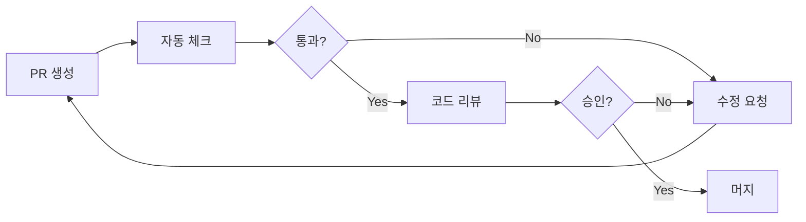
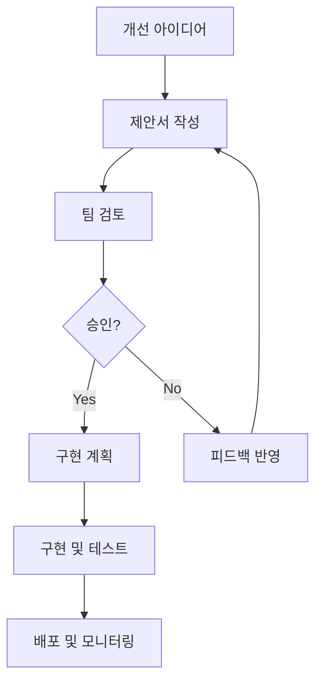

# 🏛️ 프로젝트 거버넌스

깔끔한 프로젝트를 지속적으로 유지하고 발전시키기 위한 거버넌스 체계입니다.

## 🎯 프로젝트 비전 & 원칙

### 비전
> **"항상 깔끔하고, 확장 가능하며, 유지보수하기 쉬운 코드베이스"**

### 핵심 원칙
1. **🧹 Clean Code First** - 코드 품질이 최우선
2. **🏗️ Domain-Driven** - 도메인 중심 설계
3. **🔒 Type Safety** - 타입 안전성 보장
4. **🤖 Automation** - 반복 작업 자동화
5. **📚 Documentation** - 모든 것을 문서화
6. **🔄 Continuous Improvement** - 지속적 개선

---

## 👥 역할과 책임

### 🏗️ 아키텍트 (Architect)
**책임**:
- 전체 아키텍처 설계 및 유지
- 도메인 분리 및 모듈 구조 관리
- 기술 스택 결정 및 업데이트
- 코딩 표준 및 가이드라인 수립

**권한**:
- 아키텍처 변경 승인
- 새로운 도메인 추가 승인
- 기술 스택 변경 결정
- 코딩 표준 업데이트

### 🔍 품질 관리자 (Quality Manager)
**책임**:
- 코드 품질 모니터링
- 정기 품질 감사 수행
- 자동화 도구 관리 및 개선
- 품질 메트릭 추적 및 보고

**권한**:
- 품질 기준 미달 시 배포 중단
- 품질 도구 및 프로세스 변경
- 코드 리뷰 가이드라인 수정

### 👨‍💻 개발자 (Developer)
**책임**:
- 코딩 표준 준수
- 도메인별 기능 개발
- 단위 테스트 작성
- 코드 리뷰 참여

**권한**:
- 도메인 내 구현 결정
- 리팩토링 제안
- 새로운 유틸리티 추가

### 🧪 테스터 (Tester)
**책임**:
- 통합 테스트 작성 및 실행
- E2E 테스트 시나리오 관리
- 품질 게이트 검증
- 버그 리포트 및 추적

**권한**:
- 테스트 실패 시 배포 중단 요청
- 테스트 전략 및 도구 제안

---

## 📋 의사결정 프로세스

### 🔴 Critical Changes (아키텍처 변경)
**대상**: 도메인 구조 변경, 새로운 기술 스택 도입, 전체 프로젝트 구조 변경

**프로세스**:
1. **제안서 작성** (RFC 형태)
2. **아키텍트 검토** (3일 이내)
3. **팀 토론** (1주일)
4. **최종 결정** (아키텍트 승인)
5. **구현 계획 수립**

**필요 문서**:
- 변경 사유 및 목표
- 기술적 영향도 분석
- 마이그레이션 계획
- 롤백 계획

### 🟡 Major Changes (기능 추가/변경)
**대상**: 새로운 도메인 추가, 주요 기능 변경, API 변경

**프로세스**:
1. **이슈 생성** (GitHub Issue)
2. **설계 문서 작성**
3. **코드 리뷰** (최소 2명)
4. **품질 게이트 통과**
5. **배포 승인**

**필요 문서**:
- 기능 명세서
- API 문서 (해당시)
- 테스트 계획

### 🟢 Minor Changes (버그 수정, 개선)
**대상**: 버그 수정, 성능 개선, 코드 정리

**프로세스**:
1. **PR 생성**
2. **자동 품질 체크**
3. **코드 리뷰** (최소 1명)
4. **머지 및 배포**

---

## 🔍 코드 리뷰 가이드라인

### 리뷰 기준
#### 🎯 필수 체크 항목
- [ ] **기능 요구사항 충족**
- [ ] **코딩 표준 준수**
- [ ] **타입 안전성 확보**
- [ ] **테스트 커버리지 적절**
- [ ] **성능 영향 최소화**
- [ ] **보안 취약점 없음**

#### 🏗️ 아키텍처 체크
- [ ] **올바른 도메인 분리**
- [ ] **적절한 파일 위치**
- [ ] **의존성 방향 준수**
- [ ] **재사용성 고려**

#### 📝 문서화 체크
- [ ] **코드 주석 적절**
- [ ] **API 문서 업데이트**
- [ ] **README 업데이트 (필요시)**

### 리뷰 프로세스


### 리뷰어 배정 규칙
- **도메인 변경**: 해당 도메인 전문가 + 아키텍트
- **공통 컴포넌트**: 최소 2명 (다른 도메인 개발자 포함)
- **유틸리티 함수**: 품질 관리자 + 1명
- **타입 정의**: 아키텍트 필수 포함

---

## 📊 품질 관리 체계

### 품질 메트릭
#### 🎯 목표 지표
| 메트릭 | 목표 | 측정 주기 |
|--------|------|-----------|
| TypeScript 사용률 | 100% | 일일 |
| 테스트 커버리지 | >80% | 주간 |
| 번들 크기 | <1MB | 빌드시 |
| 빌드 시간 | <2분 | 빌드시 |
| 린트 에러 | 0개 | 커밋시 |
| 보안 취약점 | 0개 (High/Critical) | 주간 |

#### 📈 품질 트렌드 추적
```typescript
interface QualityMetrics {
  date: string;
  codeQuality: number;      // 0-100
  architecture: number;     // 0-100
  performance: number;      // 0-100
  maintainability: number;  // 0-100
  security: number;         // 0-100
  overallScore: number;     // 0-100
}
```

### 품질 게이트
#### 🚪 배포 전 필수 통과 조건
```bash
# 자동 실행되는 품질 게이트
npm run quality:gate

✅ Type Check: 100% pass
✅ Lint Check: 0 errors  
✅ Unit Tests: >80% coverage
✅ Integration Tests: All pass
✅ Security Audit: 0 high/critical
✅ Performance: Bundle <1MB
```

#### 🚨 품질 게이트 실패 시 대응
1. **즉시 배포 중단**
2. **실패 원인 분석**
3. **수정 작업 수행**
4. **재검증 후 배포**

---

## 🔄 지속적 개선 프로세스

### 회고 (Retrospective)
#### 📅 주간 회고 (매주 금요일)
**참석자**: 전체 팀
**안건**:
- 이번 주 품질 메트릭 리뷰
- 발생한 이슈 및 해결 과정
- 프로세스 개선 제안
- 다음 주 목표 설정

#### 📅 월간 회고 (매월 마지막 주)
**참석자**: 전체 팀 + 스테이크홀더
**안건**:
- 월간 품질 트렌드 분석
- 아키텍처 개선 사항 검토
- 기술 부채 현황 및 해결 계획
- 다음 달 로드맵 수립

### 개선 제안 프로세스


---

## 📚 문서화 표준

### 문서 유형 및 관리
#### 📋 필수 문서
- **README.md**: 프로젝트 개요 및 시작 가이드
- **DEVELOPMENT_STANDARDS.md**: 개발 표준 및 가이드라인
- **API_DOCUMENTATION.md**: API 명세서
- **DEPLOYMENT_GUIDE.md**: 배포 가이드
- **TROUBLESHOOTING.md**: 문제 해결 가이드

#### 📝 도메인별 문서
```
docs/domains/
├── auth/
│   ├── README.md
│   ├── api.md
│   └── components.md
├── member/
│   ├── README.md
│   ├── api.md
│   └── components.md
└── club/
    ├── README.md
    ├── api.md
    └── components.md
```

#### 🔄 문서 업데이트 규칙
- **코드 변경 시**: 관련 문서 동시 업데이트
- **API 변경 시**: API 문서 필수 업데이트
- **새 기능 추가 시**: 사용자 가이드 추가
- **월 1회**: 전체 문서 검토 및 정리

---

## 🚨 위기 관리

### 긴급 상황 대응
#### 🔴 Critical Issues
**대상**: 서비스 중단, 보안 취약점, 데이터 손실

**대응 절차**:
1. **즉시 알림** (Slack/Email)
2. **긴급 팀 소집** (30분 이내)
3. **원인 분석 및 임시 조치**
4. **근본 해결책 수립**
5. **사후 분석 보고서 작성**

#### 🟡 Major Issues  
**대상**: 기능 오류, 성능 저하, 빌드 실패

**대응 절차**:
1. **이슈 등록 및 우선순위 설정**
2. **담당자 배정** (4시간 이내)
3. **해결 계획 수립**
4. **진행 상황 공유**
5. **해결 완료 및 검증**

### 롤백 계획
#### 📦 배포 롤백
```bash
# 이전 버전으로 즉시 롤백
npm run deploy:rollback

# 특정 버전으로 롤백
npm run deploy:rollback -- --version=1.2.3
```

#### 🗄️ 데이터베이스 롤백
```bash
# 스키마 롤백
npm run db:rollback

# 데이터 복구
npm run db:restore -- --backup=2024-01-01
```

---

## 📈 성과 측정 및 보고

### KPI (Key Performance Indicators)
#### 🎯 품질 KPI
- **코드 품질 점수**: 월평균 90점 이상
- **버그 발생률**: 월 5건 이하
- **배포 성공률**: 95% 이상
- **핫픽스 비율**: 전체 배포의 10% 이하

#### ⚡ 성능 KPI
- **빌드 시간**: 2분 이하
- **테스트 실행 시간**: 5분 이하
- **번들 크기**: 1MB 이하
- **페이지 로딩 시간**: 3초 이하

#### 👥 팀 KPI
- **코드 리뷰 참여율**: 100%
- **문서화 완성도**: 90% 이상
- **교육 참여율**: 80% 이상
- **개선 제안 건수**: 월 5건 이상

### 보고서 작성
#### 📊 주간 보고서
- 품질 메트릭 현황
- 완료된 작업 요약
- 발생한 이슈 및 해결
- 다음 주 계획

#### 📈 월간 보고서
- 품질 트렌드 분석
- KPI 달성 현황
- 아키텍처 개선 사항
- 기술 부채 현황
- 다음 달 목표

---

## 🎓 교육 및 온보딩

### 신규 개발자 온보딩
#### 📚 필수 학습 자료
1. **프로젝트 개요** (1일차)
   - 비전 및 원칙 이해
   - 아키텍처 개요
   - 개발 환경 설정

2. **코딩 표준** (2일차)  
   - 코딩 컨벤션 학습
   - 도메인 구조 이해
   - 품질 도구 사용법

3. **실습 과제** (3-5일차)
   - 간단한 기능 구현
   - 코드 리뷰 참여
   - 테스트 작성 실습

#### ✅ 온보딩 체크리스트
- [ ] 개발 환경 설정 완료
- [ ] 코딩 표준 이해 및 실습
- [ ] 첫 PR 생성 및 머지
- [ ] 코드 리뷰 참여 경험
- [ ] 품질 도구 사용 숙지

### 지속적 교육
#### 📅 정기 교육 (월 1회)
- **기술 세미나**: 새로운 기술 및 도구 소개
- **코드 리뷰 세션**: 우수 사례 및 개선점 공유
- **아키텍처 워크샵**: 설계 원칙 및 패턴 학습

#### 📖 자기 계발 지원
- 기술 서적 구매 지원
- 온라인 강의 수강 지원  
- 컨퍼런스 참가 지원
- 사내 기술 블로그 작성 장려

---

이 거버넌스 체계를 통해 프로젝트의 품질과 지속가능성을 보장하며, 팀 전체가 같은 방향으로 나아갈 수 있도록 합니다. 🚀
